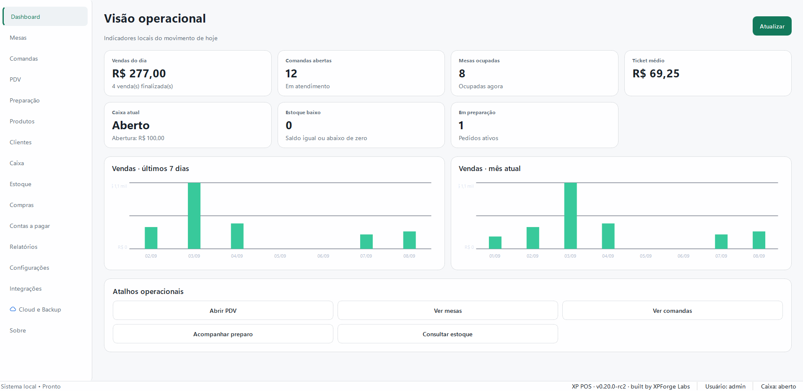
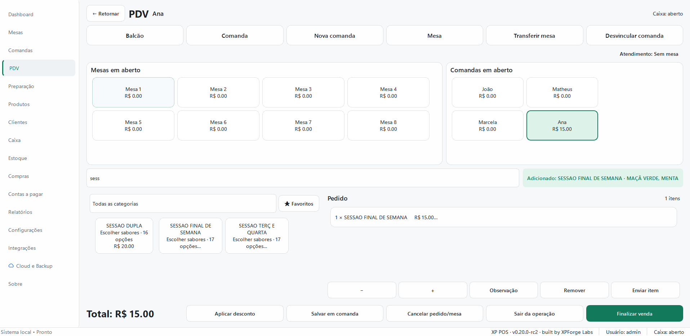
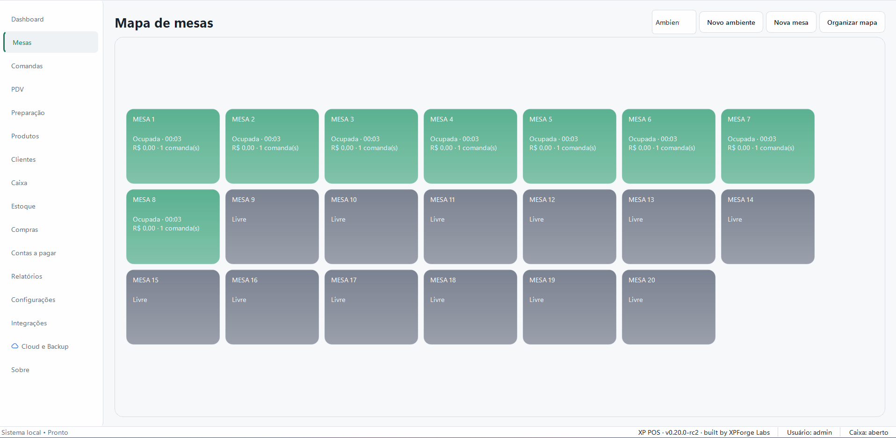
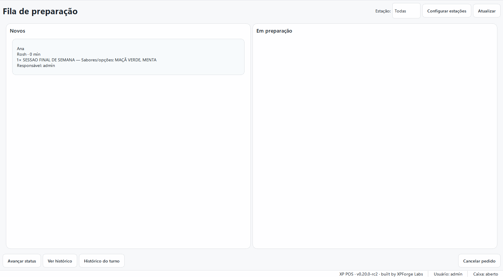
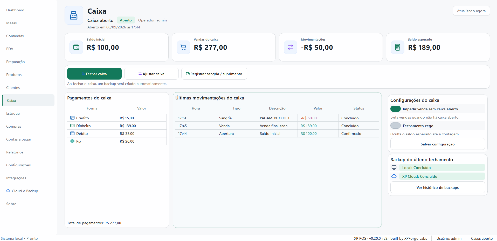
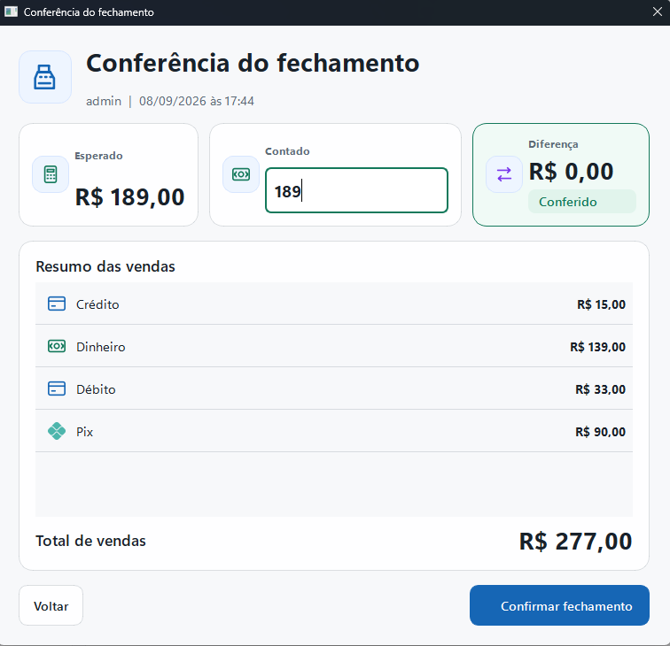
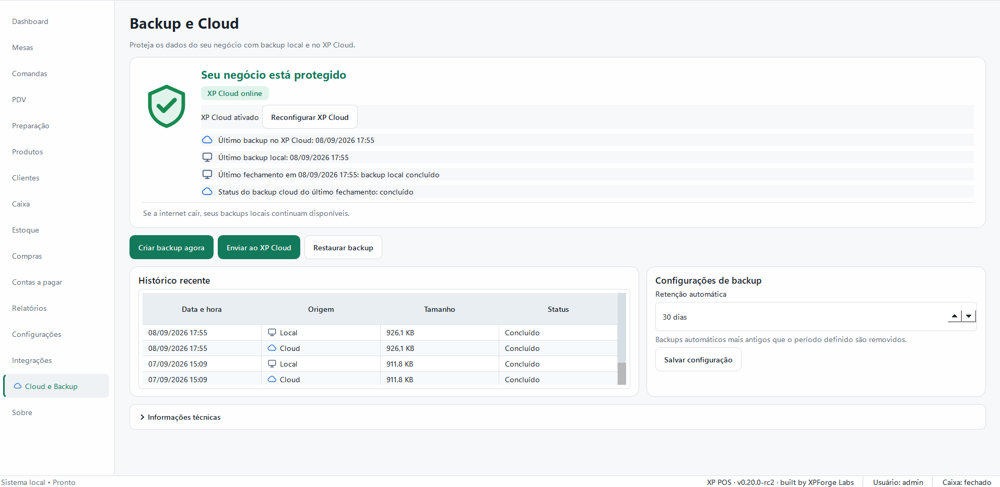
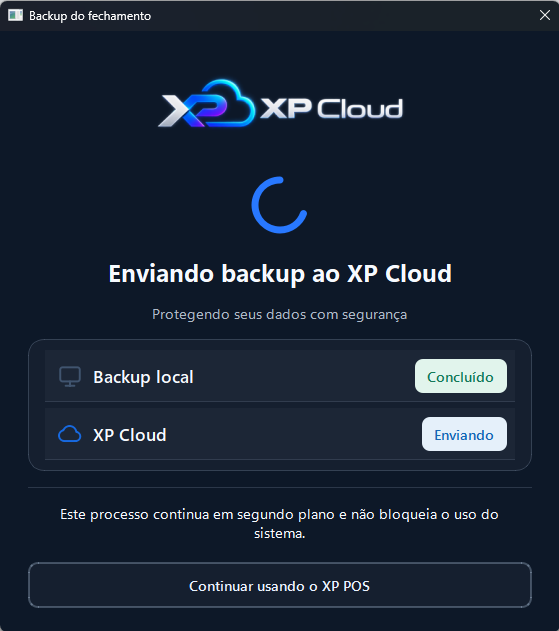
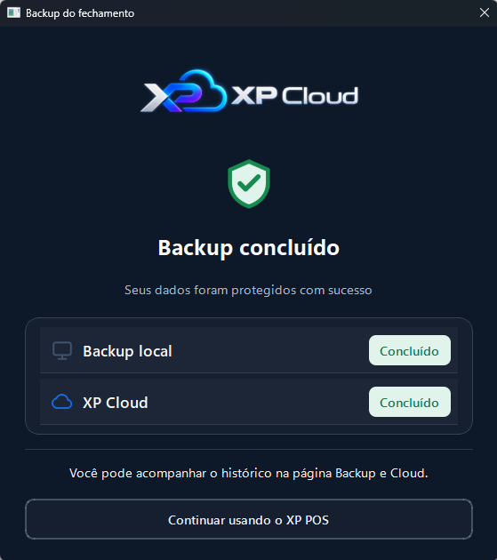

# XP POS

> **PDV e gestão operacional para pequenos negócios.**  
> **Point-of-sale and operational management for small businesses.**

## 🇧🇷 Sobre o projeto

O **XP POS** é uma aplicação desktop de **PDV e gestão operacional**, desenvolvida para centralizar a rotina de pequenos estabelecimentos comerciais em uma única interface.

O projeto combina vendas, comandas, caixa, estoque, clientes, compras, despesas, relatórios e rotinas administrativas com uma arquitetura **local-first**, permitindo que a operação principal continue funcionando sem depender permanentemente de conexão com a internet.

Além da persistência local, o sistema possui infraestrutura própria de backup em nuvem através do **XP Cloud**, criada como parte do ecossistema da XPForge Labs.

O XP POS é desenvolvido como produto da **XPForge Labs**.

> **Este é um repositório de portfólio.**  
> O XP POS é um produto proprietário. Código-fonte, banco de dados, scripts internos de build, credenciais de infraestrutura e instaladores comerciais não são distribuídos publicamente.

---

## 💡 Origem do projeto

O XP POS nasceu a partir de uma necessidade operacional real: criar uma solução de gestão que fosse simples de utilizar no atendimento diário, mas suficientemente estruturada para crescer junto com o negócio.

O projeto começou como uma solução específica para um estabelecimento piloto e evoluiu para um produto independente, com identidade, arquitetura e roadmap próprios.

---

## 🧾 PDV e vendas

- Venda de balcão, mesa ou comanda.
- Busca e seleção de produtos.
- Suporte a leitor de código de barras.
- Pagamentos simples ou mistos.
- Cálculo de troco.
- Descontos e divisão de conta.
- Estornos preservando histórico operacional.

## 🍽️ Mesas e comandas

- Cadastro de ambientes e mesas.
- Estado de ocupação.
- Associação entre mesa e comanda.
- Transferências mantendo histórico.
- Atendimento nominal quando necessário.

## 💰 Caixa

- Abertura e fechamento por turno.
- Saldo inicial.
- Valor contado no encerramento.
- Sangrias, suprimentos e ajustes.
- Consolidação por forma de pagamento.
- Cálculo de divergências.

## 📦 Produtos e estoque

- Cadastro de produtos.
- Categorias, marcas, unidades e variações.
- Custo e preço de venda.
- Entradas e saídas de estoque.
- Perdas, devoluções e ajustes.
- Estoque físico, reservado, disponível e mínimo.
- Inventários.
- Importação e exportação de catálogo.

## 🧾 Compras e despesas

- Fornecedores.
- Pedidos de compra.
- Recebimentos parciais ou integrais.
- Contas a pagar.
- Despesas.
- Pagamentos parciais ou integrais.

## 👥 Clientes

- Cadastro opcional.
- Associação com vendas e comandas.
- Controle de acesso às informações.
- Separação entre dados operacionais e consentimento para notificações.

## 📊 Relatórios

- Faturamento.
- Vendas por período.
- Ticket médio.
- Produtos e categorias.
- Formas de pagamento.
- Caixa.
- Estoque.
- Compras e despesas.
- Exportação para XLSX e PDF.

---

## ☁️ XP Cloud — backup em nuvem

O XP POS possui uma camada própria de backup remoto chamada **XP Cloud**.

O objetivo é manter a operação principal independente da internet, mas permitir que cópias protegidas dos dados sejam armazenadas fora do computador do estabelecimento.

A arquitetura atual contempla:

- backup local como base da estratégia de recuperação;
- geração de pacotes de backup próprios;
- envio opcional para o XP Cloud;
- backup automático associado a eventos operacionais, como fechamento de caixa;
- separação entre cliente e instalação;
- armazenamento organizado por cliente, instalação e período;
- preservação da cópia local mesmo quando o envio remoto falha;
- tratamento de indisponibilidade de rede sem bloquear a operação do PDV.

A infraestrutura cloud utiliza **Cloudflare Workers e Cloudflare R2** como componentes do backend de armazenamento.

O XP Cloud foi projetado como uma camada complementar ao modelo local-first, e não como dependência para o funcionamento do caixa.

---

## 💾 Backup e recuperação local

- Backup manual e automático.
- Validação das cópias.
- Restauração assistida.
- Backup preventivo antes de restauração.
- Separação entre dados persistentes e arquivos de instalação.
- Formato próprio de pacote de backup.

---

## 🔐 Usuários e segurança operacional

- Primeiro acesso com criação do administrador.
- Usuários e cargos.
- Matriz de permissões.
- Troca obrigatória de senha.
- Bloqueio temporário após tentativas inválidas.
- Operações sensíveis tratadas de maneira auditável.

---

## 🏗️ Arquitetura e stack

| Área | Tecnologia / abordagem |
|---|---|
| Linguagem | Python 3.12 |
| Interface | PySide6 / Qt |
| Persistência | SQLite |
| ORM | SQLAlchemy |
| Migrações | Alembic |
| Cloud | Cloudflare Workers + R2 |
| Documentos | ReportLab |
| Testes | pytest + pytest-qt |
| Qualidade | Ruff + mypy |
| Distribuição | Aplicação desktop para Windows |

A aplicação segue uma abordagem **local-first**, mantendo dados operacionais localmente e evitando que serviços externos sejam requisito para a operação principal.

---

## ⚙️ Decisões de engenharia

### Local-first

O estabelecimento deve continuar operando mesmo quando serviços externos ou conexão com a internet não estão disponíveis.

### Cloud como camada complementar

O XP Cloud oferece proteção adicional aos dados sem transformar conectividade em requisito para vendas ou operação do caixa.

### Histórico auditável

Operações como estornos, ajustes e movimentações de estoque priorizam registros compensatórios e preservação histórica em vez de alterações destrutivas.

### Migrações de banco

A evolução do schema é controlada com **Alembic**, permitindo atualização das estruturas persistentes entre versões do aplicativo.

### Separação entre aplicação e dados

Banco de dados, backups e dados persistentes ficam separados dos arquivos de instalação, reduzindo o risco de perda durante atualizações ou reinstalações.

### Controle de acesso

Ações e telas podem depender das permissões atribuídas ao usuário autenticado.

### Qualidade e regressão

O desenvolvimento utiliza testes automatizados, análise estática, tipagem e auditorias periódicas para identificar inconsistências sistêmicas e reduzir regressões.

---

## 🤖 Desenvolvimento assistido por IA

O XP POS também funciona como uma aplicação prática de **AI-assisted software engineering**.

Ferramentas de IA participam do processo de:

- decomposição de requisitos;
- planejamento de implementação;
- geração e refatoração de código;
- investigação de bugs;
- análise de arquitetura;
- auditorias;
- documentação;
- criação e revisão de testes.

O processo não termina na geração de código: mudanças são submetidas a testes automatizados, análise estática, revisão de comportamento e validações de regressão antes de serem incorporadas às releases.

---

## 👨‍💻 Meu papel no projeto

Sou responsável pela:

- concepção do produto;
- levantamento e definição de requisitos;
- desenho dos fluxos operacionais;
- decisões de arquitetura;
- prompt engineering e orquestração do desenvolvimento assistido por IA;
- validação de implementação;
- testes e QA;
- análise de regressões;
- documentação técnica;
- empacotamento e processo de releases;
- infraestrutura XP Cloud;
- evolução do roadmap.

---

## 🖼️ Interface

### Dashboard / Operational overview

### PDV / Point of sale

### Mesas e preparação / Tables and preparation

| Mapa de mesas | Fila de preparação |
|---|---|
|  |  |

### Caixa / Cash management

| Operação do caixa | Conferência de fechamento |
|---|---|
|  |  |

### XP Cloud

| Envio em segundo plano | Backup concluído |
|---|---|
|  |  |

> As telas acima utilizam dados de demonstração e foram selecionadas para apresentar os principais fluxos do produto.

---

## 🚧 Em evolução

O XP POS permanece em desenvolvimento ativo, com evolução gradual de funcionalidades, experiência de uso, distribuição, licenciamento, recursos fiscais e integrações externas.

---

<strong>🇺🇸 English version</strong>

# XP POS

**XP POS** is a desktop **point-of-sale and operational management application** designed for small businesses.

It combines sales, orders, cash management, inventory, customers, purchases, expenses, reporting and administrative workflows in a single interface.

The application follows a **local-first architecture**, keeping core business operations independent from permanent internet connectivity.

In addition to local persistence and backups, XP POS includes proprietary remote backup infrastructure through **XP Cloud**, developed as part of the XPForge Labs ecosystem.

XP POS is developed as a product of **XPForge Labs**.

> **This is a portfolio repository.**  
> XP POS is proprietary software. Source code, databases, internal build scripts, infrastructure credentials and commercial installers are not publicly distributed.

## Project origin

XP POS originated from a real operational requirement: building a management solution that would be easy to use during daily service while maintaining enough structure to evolve into a larger product.

It began as a solution for a pilot business and gradually evolved into an independent product with its own identity, architecture and roadmap.

## Main capabilities

- Point-of-sale workflows
- Tables and orders
- Cash management
- Inventory control
- Customers and suppliers
- Purchases and expenses
- Operational reporting
- User roles and permissions
- Local backup and recovery
- Cloud backup through XP Cloud

## XP Cloud

XP Cloud is the remote backup layer of XP POS.

The system preserves the local-first model while allowing protected copies of business data to be stored outside the customer's computer.

Current architecture includes:

- local backup as the primary recovery layer;
- proprietary backup packages;
- optional remote uploads;
- automated backups associated with operational events;
- customer and installation separation;
- organized remote storage by customer, installation and date;
- preservation of local backups if remote upload fails;
- network failure handling without blocking POS operations.

The cloud infrastructure uses **Cloudflare Workers and Cloudflare R2**.

## Architecture & technology

| Area | Technology |
|---|---|
| Language | Python 3.12 |
| Desktop UI | PySide6 / Qt |
| Persistence | SQLite |
| ORM | SQLAlchemy |
| Migrations | Alembic |
| Cloud | Cloudflare Workers + R2 |
| Documents | ReportLab |
| Testing | pytest + pytest-qt |
| Quality | Ruff + mypy |
| Distribution | Windows desktop application |

## Engineering principles

**Local-first architecture** — core operations remain independent from external services.

**Cloud as an optional layer** — XP Cloud increases data resilience without becoming a dependency for sales.

**Auditability** — reversals and adjustments preserve historical information.

**Controlled schema evolution** — Alembic manages database migrations between application versions.

**Application/data separation** — persistent data remains independent from installation files.

**Access control** — sensitive operations can be restricted according to user permissions.

**Quality assurance** — automated tests, static analysis, typing and recurring audits are used to reduce regressions.

## AI-assisted development

AI tools are used throughout the engineering workflow for requirements decomposition, implementation planning, code generation and refactoring, debugging, architecture analysis, audits, documentation and test design.

Generated changes are not treated as automatically correct. They are validated through automated testing, static analysis, regression checks and behavior verification before release.

## My role

My responsibilities include:

- product conception;
- requirements definition;
- operational flow design;
- architecture decisions;
- prompt engineering and AI-development orchestration;
- implementation validation;
- testing and QA;
- regression analysis;
- technical documentation;
- packaging and releases;
- XP Cloud infrastructure;
- roadmap evolution.

---

**XPForge Labs**  
*Build. Experience. Level-up.*
